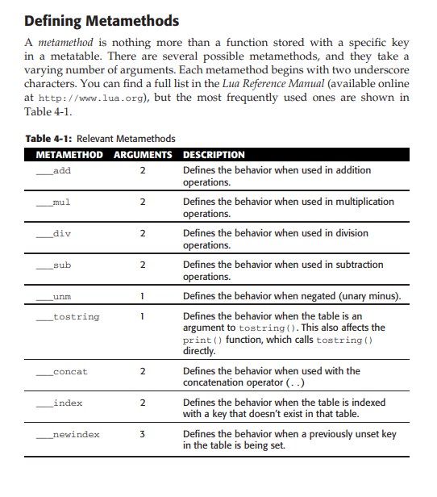

# How To Lua

This document briefly describes some basic Lua functionality. All information
is referenced almost directly from
[WoW Programming: Second Edition](https://wowprogramming.com/chapters/second-edition.html).

## Variable Bindings

Variable bindings to other variables are left intact when broken. Notice
how after changing the value of `x`, `y` still remains equal to `4`.

```lua
x=4
y=x
print(y) -- 4
x=3
print(y) -- 4
```

## Comparison Operators

COMPARISON OPERATOR EQUIVALENT LUA OPERATOR

`equality`: ==

`less than`: <

`greater than`: >

`less than, or equal`: <=

`greater than, or equal`: >=

`not equal`: ~=

The equality operators (== and ~=) can be used to compare any two values,
but the <, >, <=, and >= operators can only be used with values of the same type, such as when comparing number to number or string to string;

## Strings

### Comparison

The less than (<) and greater than (>) operators can be used on strings, but the
result depends on the way your system internally sorts the different characters.
For single character comparisons, the operator compares the two characters’
order in the character set; for multiple character strings, it compares the order of the first two differing characters.

### Concatenation

Concatenation operator: `..`

```lua
print("a" .. "b") -- ab
```

### Escaping Strings

```lua
print('I ain\'t your pal, friend!')
print("\"I ain't your pal, friend!\"")
```

### Bracket Quote

Use this to span string across multiple lines.

```lua
x = [[This is a long string,
and I can include ' and "]]
print(x)
-- This is a long string,
-- and I can include ' and "
x = [==[This is a long string, and I
can
include [], ', and "]==]
```

### Escaping Special Characters

In World of Warcraft, you typically only encounter `\n, \\, \", \’, and \xxx`,
because the output widgets in World of Warcraft don’t support the others.

### String Length

```lua
print(#"Hello World")
print(string.len("Hello World"))
```

## Type Casting

Getting the type of a value always returns the `type` as a string:

```lua
x = 1
print(type(x)) -- number
print(type(x) == "number") -- true
```

Lua will cast numbers to strings automatically:

```lua
print("Some Number: " .. 4)
> 4
```

Converting strings to numbers:

```lua
x = tonumber("1111")
print(type(x)) -- number
print(x) -- 1111
```

## Booleans Values and Operators

Logical AND, OR, NOT:

```lua
print(true and false) -- false
print(true or false) -- true
print(not(true or false)) -- false
```

Lua will short-circuit the evaluation of logical expressions. For example, if
your expression is `true or false`, only the `true` part is evaluated.

## Nil

Similar to `null` in other languages; it means a `lack of value`.

```lua
print(undefinedVariable) -- nil
print(undefinedVariable == nil) -- true
print(type(undefinedVariable) == "nil") -- true
```

## Block Scope

Lua uses block scope. This means that variables in the local block scope
take precedence over those outside of said scope.

```lua
do
  local i = 7
  do
    local i = 10
    print("Inside: " .. i)
  end
  print("Outside: " .. i)
end
-- Inside 10
-- Outside 7
```

## Chunks

A chunk is either the file being executed, or the string that is being run.
Variables within a chunk are limited to the scope of said chunk. Meaning,
variables declared in two different files aren't inherently accessible between
the two files.

Because we are using the Lua read-eval-print-loop (repl, command line), each
command is considered a chunk. This is why `i` below is `nil` between the two
commands we've issued.

```lua
local i = 10
print(i) -- nil
```

This can be fixed by encapsulating the commands in a block:

```lua
do
  local i = 10
  print(i)
end
-- 10
```

## Functions

Creating a function with the `function` keyword.

```lua
-- declare the function
helloworld = function()
print("Hello World!")
end
-- invoke it
helloworld() -- Hello World!
```

You can also declare a function like so, but know that behind the scenes,
Lua converts it to the format mentioned above:

```lua
function hello()
print("Hello World!")
end
hello()
```

> Note: know that functions can be declared with the `local` keyword as well.

Using return values:

```lua
convert_c2f = function(celsius)
  local converted = (celsius * 1.8) + 32
  return converted
end
print(convert_c2f(0)) -- 32
print(convert_c2f(-40)) -- -40
```

### Functions are First Class Citizens

They can be stored as variables, passed to other functions, and returned from
them. They can also be treated like any other variable (can be compared).

```lua
hello = function() print("Hello World!") end
print(hello == hello) -- true
hello2 = hello
print(hello2 == hello) -- true
hello2() -- Hello World!
-- Each function is unique from another, even if it does the same thing
hello2 = function() print("Hello World!") end
print(hello2 == hello) -- false
```

## Flow Control

```lua
function conditional_test(num)
  print("You input: " .. num)
  if (num == 7) then
    print("You found the magic number!")
  elseif (num == 1) then
    print("You found the other magic number!")
  end
end
conditional_test(3)
-- Your input: 3
-- You didn't find the magic number, try again!
conditional_test(7)
-- Your input: 7
-- You found the magic number!
conditional_test(13)
-- Your input: 13
-- You didn't find the magic number, try again!
```

## Error Handling

If `error()` is called, then a stack traceback is displayed.

```lua
function greeting(name)
  if (type(name) == "string") then
    print("Hello " .. name)
  else
    if (type(name) == "nil") then
      print("Hello friend")
    else
      error("Invalid name was entered")
    end
  end
end
```

## Loops

Using `while` loops:

```lua
i = 0
while i < 10 do
  print(i)
  i = i + 1
end
```

> Note: the boolean expresion in the `while` loop is evaluated prior
> to running, so if it evaluates to `false`, it is never run.

Using `repeat` loops:

```lua
i = 0
repeat
  print(i)
  i = i + 1
until (i == 10)
```

Using `for` loops:

```lua
--for variablename = start_value, end_value, step_value do
for i = 0, 10, 2 do
  print(i)
end
```

> Note: if `step_value` is not provided (the 3rd parameter for the for
> loop), Lua assumes the value is `1`. The `end_value` is only computed
> once at the start of the loop and cannot be changed mid-execution of the
> loop.

## Tables

These are similar to arrays, dictionaries, hash tables, hash maps,
associative arrays (etc.) from other languages. A `Table` is a collection
of records stored in a `key, value` pair.

```lua
alice = {}
alice["name"] = "Alice Applebaum"
alice["phone"] = "+1-212-555-1434"
alice["address1"] = "114 Auburn Street"
alice["address2"] = "Apt 14"
alice["city"] = "Atlanta"
alice["state"] = "Georgia"
-- accessing a table by key index (1)
print(alice["name"])
-- Alice Applebaum
-- accessing a table by key via dot notation (2)
print(alice.address1)
-- 114 Auburn Street
-- printing the table itself results in an address
print(alice)
-- 00BB66E8
```

> Note: you cannot use the `.` (dot) syntax to access a key
> that starts with a number, or is named as a `reserved word`.
> Instead use the index method.

Accessing an unset value in the table:

```lua
print(alice["fax"]) -- nil
```

Deleting a value in the table:

```lua
alice["state"] = nil
print(alice["state"]) -- nil
```

Initializing a table with values:

```lua
x = 5
mytable = {
  ["key1"] = "value1",
  ["key2"] = x,
}
```

### Using Tables as Arrays

Either way works:
```lua
tbl1 = {
10,
9,
8,
}

tbl2= {
[1] = 5,
[2] = 4,
[3] = 3,
-- nested table
["nested"] = "lol"
}
-- print length of tables
print(#tbl1) -- 3
-- notice how tbl1 does not count the nested table
print(#tbl2) -- 3
```

### Iterating over Tables

```lua
for i = 1, #tbl2 do
  print(tbl2[i])
end
-- 5
-- 4
-- 3
```

### Add Elements to an Array

The bad way to do it:

```lua
tbl2[#tbl2 + 1] = "new element"
print(tbl2[#tbl2])
```

The good way to do it:
```lua
-- tbl2.insert(tbl, value)
table.insert(tbl2, "another new element")
print(tbl2[#tbl2])

-- You can also insert at a specific index using this function signature:
-- table.insert(tbl, position, value)
```
### Remove Elements from an Array
```lua
-- remove an item from tbl2 at a specific index
table.remove(tbl2, #tbl2)
-- pop off the last item from tbl2 and store into a variable
removedValue = table.remove(tbl2)
print(removedValue)
```

### Sorting a Table

```lua
tbl = {5,4,3,2,1}
table.sort(tbl)
```

## Namespacing Tables

You can use namespacing to group things together. Ideally, operations that
might need to operate on a specific table.

Create a `util` namespace (in the form of a table):

```lua
util = {}
```

Now we can add a function to that table. This effectively serves as
a means of `namespacing`:

```lua
function util.factorial(num)
  local total = 1
    for i = 1, num do
      total = total * i
    end
  return total
end

print(util.factorial(5))
```

> Note: you can also explicitly create an index on the table and set it
> equal to a function. The above method is most commonly used, however.

## Object Oriented Programming in Lua

Below is an example of how to encapsulate variables using a
`closure pattern`. This means you can make `counter` what is known as a
`private` variable in the object oriented programming (OOP) world. When a
variable is private in OOP, it usally means you cannot access it from outside
of the `block` we've created.

Note that the below example is somewhat similar to OOP, but it in and of itself
is not OOP. We will follow up with an OOP example afterwards.

```lua
-- non-oop example of privatizing a variable
do
  -- Create a counter that cannot be accessed outside this scope
  local counter = 0
  -- Global functions to interact with counter
  function counter_get()
    return counter
  end
  function counter_inc()
    counter = counter + 1
  end
end
print(counter_get()) -- 0
print(counter_inc())
print(counter_inc())
print(counter_get()) -- 2
-- you cannot access counter from outside of the block scope, without
-- using the inc/get (functions) API provided!
print(counter) -- nil
```

We can use Tables as Objects. Let's redo the above in an OOP manner.

```lua
-- initialize the counter object
counter = {
  count = 0
}

function counter.get(self)
  return self.count
end

function counter.inc(self)
  self.count = self.count + 1
end

print(counter.get(counter)) -- 0
counter.inc(counter)
print(counter.get(counter)) -- 1
```

These methods use the built-in `self` argument in order to refer
to a `counter` object. You can pass any counter object into these
methods as well

```lua
counter2 = {
 count = 15,
 get = counter.get,
 inc = counter.inc,
}
print(counter.get(counter2)) -- 15
print(counter.get == counter2.get) -- true
```

Instead of typing `counter.get(counter)`, you can call `counter:get()`.
This is syntactic sugar that converts the latter into the former.

```lua
-- using the counter object from earlier

counter:inc()
counter:inc()
print(counter:get())
```

> Note: If you attempt to call a method that expects the self argument
> with a period instead of a colon, you might get an error similar to
> this: stdin:2: attempt to index local 'self' (a nil value).

The method we've used to create counter objects above is a bit dated,
because of how we initialize the counter itself. Here is a more
familiar "OOP" means of doing it:

```lua
-- Create a new scope for local variables
do
  local function get(self)
    return self.count
  end

  local function inc(self)
    self.count = self.count + 1
  end

  function new_counter(value)
    if type(value) ~= "number" then
    value = 0
  end

    local obj = {
    count = value,
    get = get,
    inc = inc,
    }
    
    return obj
  end
end

counter = new_counter()
print(counter:get())
counter:inc()
counter:inc()
counter:inc()
print(counter:get()) -- 3
```

## Metatables

Each table can have a `metatable` attached to it, which tells Lua
how a table should be treated when it is used. For example,
when printing a table object, we get an address. What if we wanted
the default behaviour to simply print the contents of the table?
We can do that with metatables.

```lua
tbl1 = {"alpha", "beta", "gamma"}
tbl2 = {"delta", "epsilon", "zeta"}
tbl3 = {}
mt = {}
setmetatable(tbl1, mt)
setmetatable(tbl2, mt)
setmetatable(tbl3, mt)

-- combine two tables
function mt.__add(a,b)
  local result = setmetatable({}, mt)
  -- Copy table a in first
  for i = 1, #a do
    table.insert(result, a[i])
  end
  -- Copy table b in second
  for i = 1, #b do
    table.insert(result, b[i])
  end
  return result
end

-- print at abl
function mt.__tostring(tbl)
  local result = "{"
  for i = 1, #tbl do
    if i > 1 then
      result = result .. ", "
    end
      result = result .. tostring(tbl[i])
  end
  result = result .. "}"
  return result
end
-- verify the metatable is set
print(getmetatable(tbl1) == mt) -- true
-- combine tables using our __add() metamethod
add_test = tbl1 + tbl2
print(#add_test)
-- print using the __tostring() metamethod
print(add_test)
```

See the below image for `metatable metamethods`:

> Note: a metamethod starts with `two underscores`: `__string()`



> Tip: the `__concat()` metamethods works on `..` operations between
> two tables.

### Exploring Fallback Tables with __index

We can leverage the `__index` metamethod to handle cases when we try to access
a table at a specific index, but the index is `nil`. You can think of this
behaviour as somewhat similar to the `JavaScript Prototype Chain`.

Take the following example, where we want a metamethod that allows translation
to German:

```lua
-- init english to german translation table
tbl4 = {["Night elf"] = "Nachtelf"}
-- link the meta table to this table
setmetatable(tbl4, mt)
-- init defaults, for when an implementing table does not contain keys for
-- a specific language
enUS_defaults = {
  ["Human"] = "Human",
  ["Night elf"] = "Night elf",
}
-- implement the __index metamethod
mt.__index = enUS_defaults
-- translate "Night elf" to german using tbl4
print(tbl4["Night elf"]) --Nachtelf
-- translate "Human" to german using tbl4; note that it falls back to "Human"
-- as there is no translation (no index for "Human") defined in tbl4
print(tbl4["Human"]) --Human
-- see the same happens for tbl3
print(tbl3["Night elf"]) --Night elf
```

Extend the `enUS_defaults` table to return the given input if it is not found
in any of the translation tables. This allows us to not have to define the
same default values (the WoW races in english) in every single table:

```lua
defaults_mt = {
  __index = function(tbl, key)
    if type(key) == "string" then
        print("Return default value of '" .. key .. "' for key: " .. key)
      return key
      else
        return nil
      end
    end,
}
setmetatable(enUS_defaults, defaults_mt)
print(tbl4["Night elf"]) -- Nachtelf
print(tbl4["Human"]) -- Human
print(tbl4["Gnome"]) -- Return default value of 'Gnome' for key: Gnome
-- Gnome
print(tbl4[1]) -- nil
```

### Catching Creation of Keys with __newindex

You can use this to dictate how a value is set on a key in a table, or to
prevent the setting of a specific key entirely:

```lua
function mt.__newindex(tbl, key, value)
  if key == "banana" then
    error("Cannot set a protected key")
  else
    rawset(tbl, key, value)
  end
end
```

### Bypassing Metatables

To get a value from a table while bypassing a metatable:

```lua
value = rawget(tbl, key)
```

To set a value from a table while bypassing a metatable:

```lua
rawset(tbl, key, value)
```

## Advanced Functions and Control Structures

See Chapter 5 in the aforementioned book.